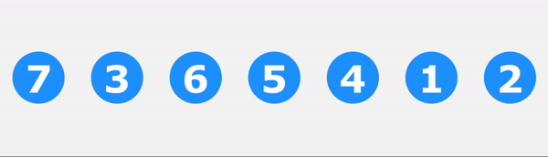

# Bubble Sort Visualizer

<br>


## Overview

Bubble Sort Visualizer is a simple tool that visually demonstrates the Bubble Sort algorithm. 
Users can shuffle numbers and watch how the algorithm sorts them step-by-step through animations, making it easier to understand the sorting process.

## Requirements and Setup

The program is built using the JavaFX framework, which requires proper configuration of the JavaFX libraries. The following dependencies are necessary to run the project:

- `javafx-controls`
- `javafx-fxml`

To start the application, run the `BubbleSortVisualizer.java` file located in the `com.example.bubblesortvisualizer` package.

## Bubble Sort Algorithm Overview

Bubble Sort is a basic sorting algorithm that works by repeatedly passing through a list, comparing neighboring elements, and swapping them when they are in the wrong sequence. 
The process is repeated until the list is sorted.
<br>
<br>
Below is a sample implementation of the Bubble Sort algorithm in Java:

```java
void bubbleSort(int[] arr) {
    int n = arr.length;
    boolean swapped;

    for (int i = 0; i < n - 1; i++) {
        swapped = false;
        for (int j = 0; j < n - i - 1; j++) {
            if (arr[j] > arr[j + 1]) {
                int temp = arr[j];
                arr[j] = arr[j + 1];
                arr[j + 1] = temp;
                swapped = true;
            }
        }
        if (!swapped) break;
    }
}
```

__Key Characteristics:__

- __Time Complexity:__ O(n^2) in the average and worst cases, making it inefficient on large lists.
- __Stability:__ Bubble sort is a stable sorting algorithm, meaning that it maintains the relative order of equal elements.
- __In-Place Sorting:__ The algorithm requires only a constant amount of additional space.

__Note:__

Although the above code demonstrates a standard implementation of the Bubble Sort algorithm, it is important to note that my application intentionally omits the swap check mechanism.
This design choice was made to enhance the visual clarity and animation of the sorting process.
By focusing on the visual representation of each comparison and swap, the animation aims to provide a more engaging and educational experience for users observing the sorting procedure.


## How the Visualizer Works

- __Event-Based Sorting Animation:__ The sorting algorithm is implemented as Bubble Sort, but instead of directly updating the UI with each comparison and swap, it generates a series of events.
- __SortEvent List:__ Each comparison and swap is recorded as an event in a `SortEvent` list. This list contains the details of which elements are compared or swapped.
- __Event-Driven Animation:__ The animation is then driven by processing this `SortEvent` list step-by-step. For each event, the corresponding circles are animated to visually represent the comparison or swap.
- __Separation of Concerns:__ The sorting logic and animation logic are separated to maintain clean code. The sorting algorithm itself doesn't handle any UI updates directly; it only generates events. The UI layer is responsible for interpreting these events and triggering the animations.

